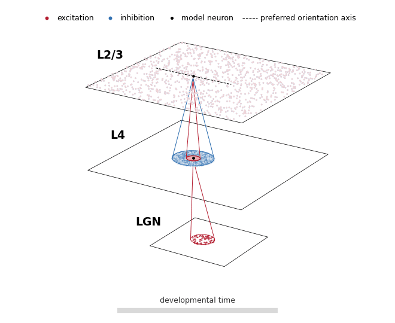
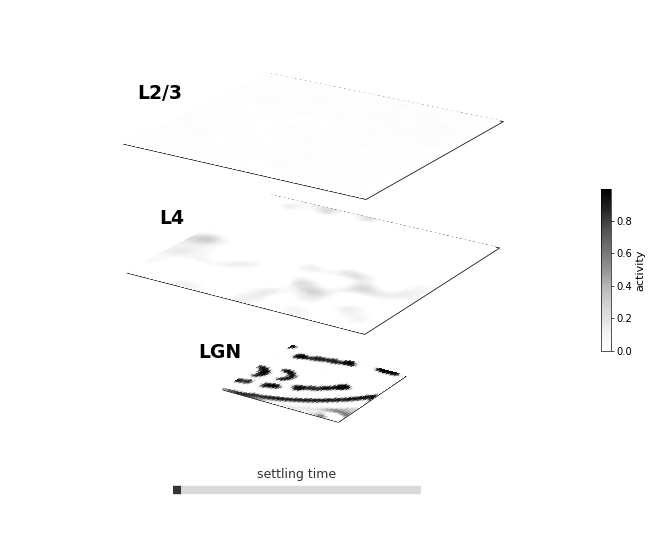
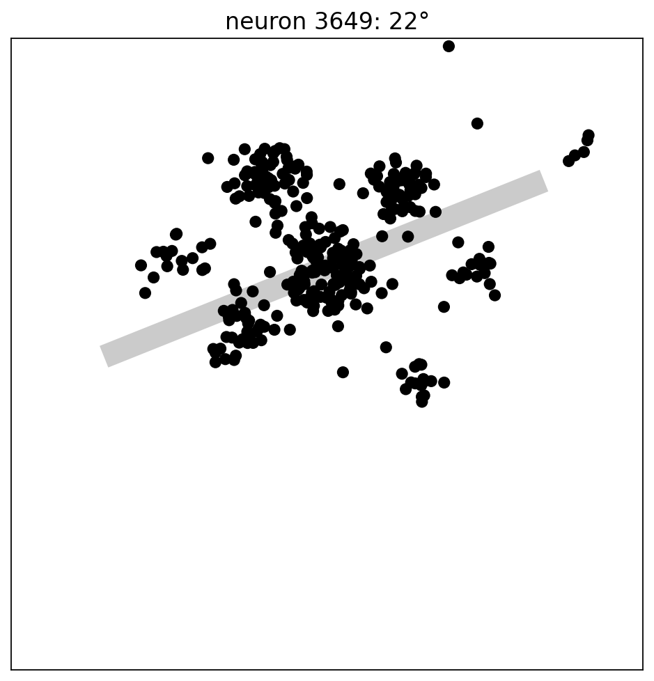
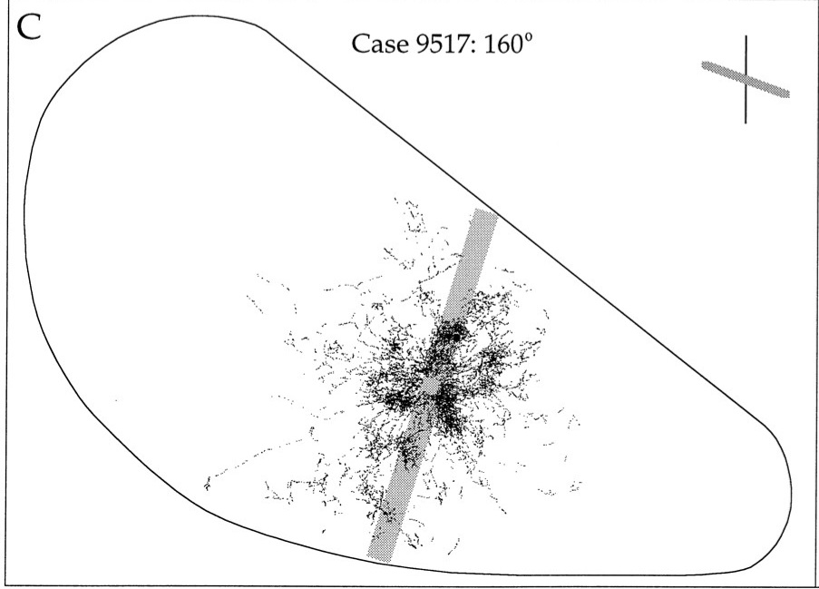
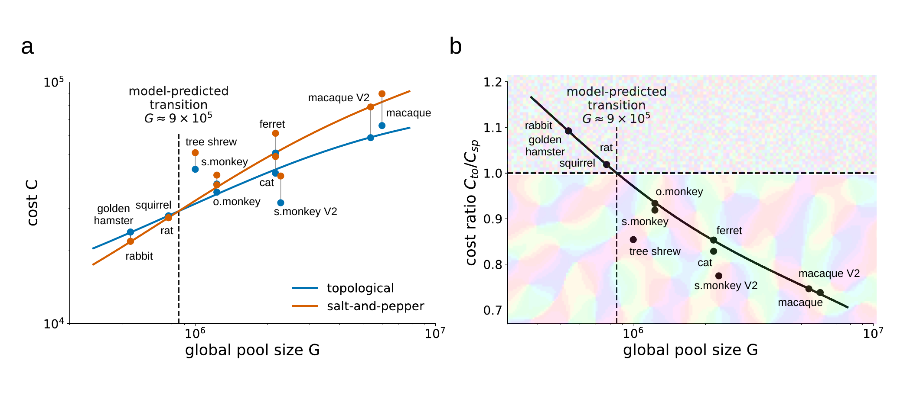

# From self-organisation to cortical map evolution

Why do some animals arrange visual cortex into smooth maps, while others mix
neighbouring preferences in a salt-and-pepper pattern? This demo follows one
self-organising network from visual input to learned cortical structure, then
uses it to motivate a simple answer: evolution may be balancing the cost of
nearby and far-reaching connections.

The model is inspired by **GCAL**, a model in which visual experience, recurrent
activity and Hebbian learning jointly shape receptive fields and cortical maps
([Stevens et al., 2013](https://doi.org/10.1523/JNEUROSCI.1037-13.2013)). The
version shown here adds a second cortical stage so that we can watch structure
spread from layer 4 into layers 2/3.

## 1. A map learns its own wiring

Read the animation from bottom to top. The **LGN** relays small patches of the
visual input to **layer 4 (L4)**. With experience, L4 neurons learn selective
receptive fields: each becomes especially responsive to an edge at a particular
angle. **Layers 2/3 (L2/3)** receive both excitation and inhibition from L4,
then combine short-range interactions with learned, longer-range lateral
connections.

Red marks net excitation, blue marks net inhibition and the black dot is the
model neuron whose incoming connections are being followed. The dashed line on
L2/3 is its preferred orientation axis. As learning proceeds, the long-range
connections become patchy and tend to reach other regions that represent
related orientations.

## 2. Let the activity settle

The learned network does not answer a visual input all at once. Activity is
allowed to settle through a short recurrent conversation. L4 turns the LGN
signal into a sparse cortical code that remains strongly tied to the incoming
image. L2/3 then uses its lateral interactions to refine that code into a
sharper response.

## 3. Repeated activity becomes a map

Every settled response leaves a small trace in the connections. Hebbian
learning strengthens pathways between neurons that are repeatedly active
together. Across many natural images, those local changes consolidate into
large-scale orientation maps in both L4 and L2/3.

Colour shows preferred edge orientation. The black-and-white panels show the
corresponding Fourier power: the emerging ring is the signature of orientations
repeating at a characteristic spacing across the cortical sheet.

## 4. A connection field the model was never shown

The final learned L2/3 connection field is strikingly similar to an anatomical
tracing from tree-shrew visual cortex. The biological example is from
[Bosking et al. (1997)](https://doi.org/10.1523/JNEUROSCI.17-06-02112.1997).
The model panel shows an importance sample from one neuron's learned patchy
lateral excitation. Its grey line marks that neuron's preferred orientation
axis. A small continuous positional scatter makes the model lattice less
conspicuous; its mean displacement is the same two-cell value explored in the
[microdomains demo](https://github.com/nicolamendini/microdomains).

<table>
  <tr>
    <th width="50%">Self-organising model</th>
    <th width="50%">Tree shrew</th>
  </tr>
  <tr>
    <td></td>
    <td></td>
  </tr>
</table>

## 5. From one network to an evolutionary trade-off

The animations suggest a useful distinction. A **local connection pool** builds
and supports a domain of similarly tuned neurons. A **global connection pool**
is the much larger territory from which selective long-range connections can
be drawn. Large local domains cost more to build, but their pooling can make
the representation robust enough to tolerate much sparser global wiring.

That gives evolution two viable strategies:

- A salt-and-pepper organisation keeps the local pool small, but may need a
  denser sample of its global pool.
- A topological map pays for larger local domains, but may recover that cost by
  making long-range connectivity much sparser.

In the model, total realised wiring is written as

\[
C = \frac{L}{1+s_L} + \frac{G}{1+s_G},
\]

where \(L\) and \(G\) are the available local and global pools, and \(s_L\)
and \(s_G\) describe how sparse their realised connections can be while the
network remains stable. The simulations identify the stability-preserving
local/global sparsity combinations; the least costly one is selected for each
pool size. The important idea is the trade-off, not the algebra: **topological
maps are favoured when the global savings enabled by domain pooling exceed the
local cost of building those domains.**

## 6. Does the trade-off match real animals?

To make a deliberately simple cross-species test, orientation-domain size is
used as a proxy for the local pool. Self-organising models predict that larger
domains require wider local interactions to establish them. The global pool is
estimated as the number of neurons inside an elliptical cylinder reaching the
maximum measured span of horizontal lateral connectivity. Both imagined
cylinders extend through the full cortical depth; areal neuronal density
therefore converts their footprints into candidate-neuron counts.

These are **candidate connection pools, not synapse counts**. They measure the
space from which a neuron could draw local or global partners—and therefore the
opportunity for sparse wiring.

| Species / area | Organisation | Span r (mm) | Elongation s | Neurons under 1 mm² η (10³) | Global pool P (10³) | Map period Λ (mm) | Local/domain pool D (10³) |
|---|---|---:|---:|---:|---:|---:|---:|
| Hamster V1 | Salt-and-pepper | 1.5 | 0.76† | 100† | 537 | 0.10† | 1 |
| Rat V1 | Salt-and-pepper | 1.8 | 0.76† | 100 | 774 | 0.10† | 1 |
| Squirrel V1 | Salt-and-pepper | 1.8 | 0.76 | 100† | 774 | 0.10† | 1 |
| Rabbit V1 | Salt-and-pepper | 1.5 | 0.76† | 100† | 537 | 0.10† | 1 |
| Tree shrew V1 | Topological | 2.5 | 0.51 | 100† | 1,000 | 0.63 | 31 |
| Cat V1 | Topological | 3.5 | 0.56† | 100 | 2,160 | 1.00 | 79 |
| Ferret V1 | Topological | 3.5 | 0.56† | 100† | 2,160 | 0.85 | 57 |
| Squirrel monkey V1 | Topological | 1.6 | 0.61 | 250† | 1,230 | 0.51 | 51 |
| Squirrel monkey V2 | Topological | 2.5 | 0.68† | 170 | 2,270 | 1.02 | 139 |
| Owl monkey V1 | Topological | 1.6 | 0.61 | 250† | 1,230 | 0.65 | 59 |
| Macaque V1 | Topological | 3.7 | 0.56 | 250 | 6,000 | 0.76 | 113 |
| Macaque V2 | Topological | 4.0 | 0.63 | 170 | 5,380 | 0.95 | 120 |

† Estimated value. The two original tables, their literature sources and their
estimation rules are retained in the accompanying manuscript draft. Here they
are merged so the local and global pool estimates can be read together.

## The result

When these animal estimates are placed against the transition predicted by the
model, species with salt-and-pepper and topological maps separate clearly. The
same simple wiring-economy argument that emerges from the simulations therefore
organises the comparative data across primate and non-primate species.

The broad picture is simple: the cortex can spend connections locally to build
a map, or spend them globally to coordinate a less ordered sheet. Different
brains appear to settle on different sides of the same economical compromise.
